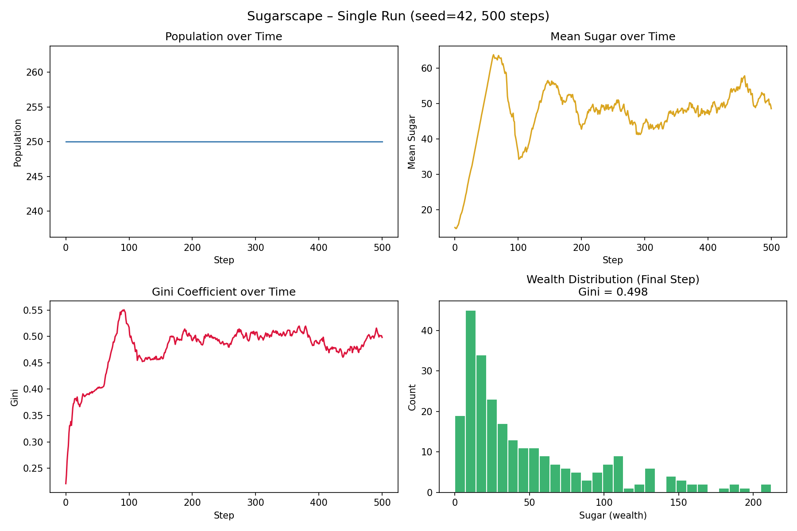
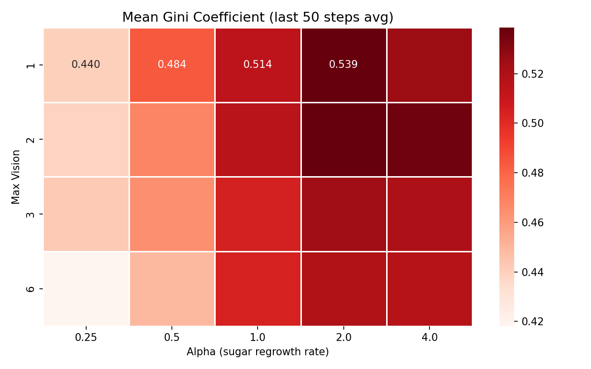
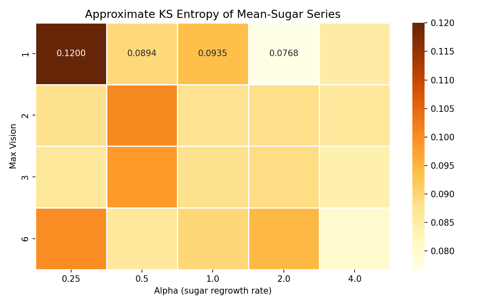
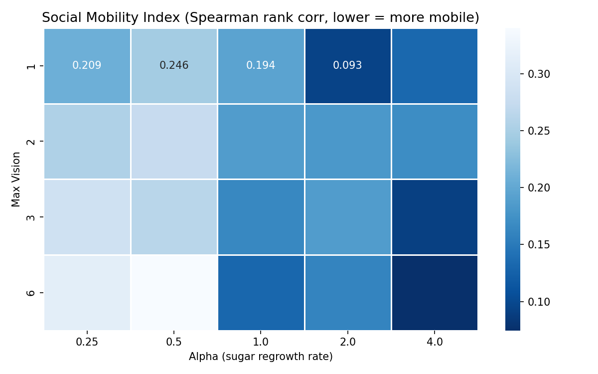

# Memory: Optimal KS Entropy for Social Progress

## Table of Contents

1. [Project Overview](#1-project-overview)
2. [Long-Term Research Goals](#2-long-term-research-goals)
3. [Theoretical Background](#3-theoretical-background)
   - [KS Entropy as a Measure of Memory](#ks-entropy-as-a-measure-of-memory)
   - [The Sugarscape Model](#the-sugarscape-model)
   - [Connecting the Model to the Theory](#connecting-the-model-to-the-theory)
4. [Repository Structure](#4-repository-structure)
5. [Setup and Usage](#5-setup-and-usage)
6. [Results: Single Run](#6-results-single-run)
7. [Results: Parameter Sweep](#7-results-parameter-sweep)
   - [Gini Coefficient Heatmap](#gini-coefficient-heatmap)
   - [KS Entropy Heatmap](#ks-entropy-heatmap)
   - [Social Mobility Index Heatmap](#social-mobility-index-heatmap)
8. [Current Findings](#8-current-findings)
9. [Roadmap](#9-roadmap)

---

## 1. Project Overview

Memory is simultaneously one of the most empowering and crippling qualities that humanity possesses. Our memories enable us to learn, adapt, and celebrate old traditions. Without a strong memory, we would quickly forget the lessons we have learned and never be able to advance. However, too strong a memory can act as an inertial force, holding us back from change. We get stuck in bad habits and fall victim to past trauma. How many world religions preach forgiveness in some way or another? How many times have we heard that the secret to success and happiness is staying present? There is a fine line between a healthy respect for the past and becoming overly traditional.

I aim to answer the questions: how much memory is optimal for growth? How far back into a system's history must we go until the past no longer has significant influence on the present? These questions lead me to learning about ergodic theory. We must first be able to quantify a system's memory.

---

## 2. Long-Term Research Goals

The project unfolds in three phases:

**Phase 1 — Baseline (current):** Implement the Sugarscape agent-based model as a controlled laboratory for social dynamics. Establish a clean, reproducible simulation pipeline and verify that the model produces realistic emergent inequality and wealth dynamics. Sweep over parameters that implicitly control the system's memory and record outcomes.

**Phase 2 — Memory as a first-class parameter:** Extend the Sugarscape model so agents have explicit, tunable memory. Agents will maintain a history of past sugar levels at visited locations and weight their movement decisions by this history. The depth and decay rate of this memory will become explicit parameters tied to the KS entropy of the resulting dynamical system.

**Phase 3 — Optimization:** Define a meritocracy score — a composite metric capturing social mobility, wealth equality, and productive efficiency — and identify the KS entropy that maximizes it. Apply the same framework to real-world time-series data (e.g., economic mobility indices) to test whether the optimal entropy identified in simulation matches empirical patterns.

The theoretical backbone is described in [PHILOSOPHY.md](PHILOSOPHY.md).

---

## 3. Theoretical Background

### KS Entropy as a Measure of Memory

The Kolmogorov-Sinai entropy $h_\mu(T)$ of a measure-preserving dynamical system $(X, \mathcal{B}, \mu, T)$ measures the rate at which the system generates new Shannon information over time. Formally, it is the supremum over all finite measurable partitions $\mathcal{P}$ of the partition entropy rate:

$$h_\mu(T) = \sup_{\mathcal{P}} \lim_{n \to \infty} \frac{1}{n} H_\mu\!\left(\bigvee_{i=0}^{n-1} T^{-i}\mathcal{P}\right)$$

A system with $h_\mu(T) = 0$ is deterministic — knowing the present state perfectly predicts all future states. A system with $h_\mu(T) > 0$ is chaotic — information is continually lost and regenerated, and the present depends only weakly on the distant past.

KS entropy is therefore a precise measure of memory length: the higher the entropy, the shorter the system's effective memory.

### The Sugarscape Model

The Sugarscape model (Epstein & Axtell, *Growing Artificial Societies*, 1996) is a canonical agent-based model of resource competition and wealth accumulation. The implementation here follows the original specification closely:

**Environment:** A 50×50 toroidal grid where each cell has a maximum sugar capacity `sugar_max` $\in \{0,1,2,3,4\}$, initialized via two Gaussian peaks (centered at (15,15) and (35,35), $\sigma = 10$) scaled so the peak cell has capacity 4. Each step, every cell's sugar grows by $\alpha$ (the regrowth rate) up to its maximum.

**Agents:** 250 agents are placed at random cells. Each agent is characterized by:
- **Sugar** — initial wealth, drawn from Uniform(5, 25)
- **Metabolism** — energy cost per step, drawn from Uniform(1, 4)
- **Vision** — how far the agent can see in each cardinal direction, drawn from Uniform(1, `max_vision`)
- **Max age** — lifespan, drawn from Uniform(60, 100)

**Agent behavior (each step, in random order):**
1. Look up to `vision` cells in all 4 cardinal directions; collect candidates
2. Move to the candidate cell with the most sugar (nearest first on ties)
3. Harvest all sugar on that cell; add it to personal wealth
4. Pay metabolism cost; increment age
5. Die if wealth drops below zero or age exceeds max age; immediately replaced by a new agent at a random empty cell

**Sugar regrowth:** After all agents have moved, every cell's sugar increases by $\alpha$, capped at `sugar_max`.

### Connecting the Model to the Theory

The two swept parameters — `max_vision` and `alpha` — implicitly control how deterministic the wealth dynamics are, and therefore the effective memory of the system:

- **`alpha` (regrowth rate):** Low alpha creates persistent sugar scarcity. Agents compete intensely for sparse resources, and the spatial distribution of sugar changes slowly and predictably. This produces a more deterministic, lower-entropy environment. High alpha rapidly replenishes sugar everywhere, reducing the informational value of any particular location and making agent trajectories more noisy.

- **`max_vision`:** Low vision restricts agents to local foraging. Their decisions depend on a small neighborhood, creating highly path-dependent dynamics — where an agent ends up is strongly influenced by where it started. This constitutes long memory. High vision allows agents to survey large areas and always move toward the best available cell, making each step more of a global optimization and less dependent on recent history — shorter memory.

KS entropy is estimated from the mean-sugar time series using the **Grassberger-Procaccia K2 correlation entropy** method: the time series is embedded in a higher-dimensional space using time-delay embedding, and the rate of change of the correlation integral across embedding dimensions gives a lower bound on KS entropy.

---

## 4. Repository Structure

```
memory/
├── sugarscape/
│   ├── __init__.py       # Package exports
│   ├── config.py         # SugarscapeConfig dataclass
│   ├── grid.py           # Sugar landscape initialization
│   ├── agents.py         # SugarAgent class
│   ├── model.py          # SugarscapeModel class
│   ├── metrics.py        # Gini, social mobility, KS entropy
│   └── experiment.py     # Parameter sweep runner
├── scripts/
│   ├── run_single.py     # Single simulation + diagnostic plots
│   └── run_sweep.py      # Parameter sweep + heatmaps
├── results/              # Generated outputs (CSV, PNG)
├── PHILOSOPHY.md         # Project philosophy and ergodic theory background
└── README.md
```

---

## 5. Setup and Usage

**Install dependencies:**
```bash
pip install mesa numpy pandas matplotlib seaborn scipy
```

**Run a single simulation (500 steps, default parameters):**
```bash
python scripts/run_single.py
```
Outputs: `results/single_run.png`, prints Gini, mean sugar, and KS entropy to stdout.

**Run the parameter sweep:**
```bash
python scripts/run_sweep.py
```
Sweeps `max_vision` ∈ {1, 2, 3, 6} × `alpha` ∈ {0.25, 0.5, 1.0, 2.0, 4.0} × 5 seeds = 100 runs.
Outputs: `results/sweep_results.csv`, three heatmap PNGs.

**Default configuration** (`sugarscape/config.py`):

| Parameter | Default | Description |
|---|---|---|
| `grid_width` / `grid_height` | 50 | Grid dimensions |
| `alpha` | 1.0 | Sugar regrowth per step |
| `n_agents` | 250 | Initial agent count |
| `max_vision` | 6 | Upper bound of vision distribution |
| `n_steps` | 500 | Simulation length |
| `seed` | 42 | Random seed |

---

## 6. Results: Single Run

`results/single_run.png` — default parameters, 500 steps, seed 42.



The four panels show:

**Top left — Population over Time:** Population is held exactly constant at 250 throughout the simulation. When an agent dies (from starvation or old age), it is immediately replaced by a new agent at a random empty cell. This confirms the replacement mechanism is functioning correctly.

**Top right — Mean Sugar over Time:** Average agent wealth rises sharply in the first ~50 steps as agents spread across the grid and begin accumulating sugar. It peaks around step 60 (~63 sugar units), then falls as competition intensifies and the landscape's carrying capacity asserts itself. The series then oscillates in a quasi-stationary regime around ~48 sugar units for the remainder of the run. This non-trivial dynamics — rather than convergence to a fixed point — is what produces a meaningful KS entropy estimate.

**Bottom left — Gini Coefficient over Time:** Inequality starts low (~0.22) when all agents have freshly drawn initial endowments. It rises steeply as the landscape differentiates agents by vision and metabolism, peaking near ~0.55 around step 90, then settling into a noisy steady state near 0.49–0.51. This reflects the well-known result from the original Sugarscape model: wealth inequality is an emergent property of simple local rules, not an assumption.

**Bottom right — Wealth Distribution (Final Step):** The histogram of agent sugar at step 500 is strongly right-skewed. Most agents hold modest wealth (mode around 5–15 sugar units), while a long tail of wealthier agents extends to over 200 units. This shape is characteristic of Sugarscape and broadly resembles empirical wealth distributions. The annotated Gini coefficient of 0.498 confirms substantial inequality.

---

## 7. Results: Parameter Sweep

100 simulations across `max_vision` ∈ {1, 2, 3, 6} × `alpha` ∈ {0.25, 0.5, 1.0, 2.0, 4.0}, 5 seeds each, 300 steps per run. Results averaged across seeds.

### Gini Coefficient Heatmap

`results/sweep_gini_heatmap.png`



Each cell shows the mean Gini coefficient averaged over the last 50 steps and 5 seeds. Darker red = higher inequality.

The dominant pattern is **alpha drives inequality up, vision drives it down (at low alpha)**. At `alpha=0.25`, Gini ranges from ~0.42 (vision=6) to ~0.44 (vision=1) — relatively equal, because scarce sugar keeps all agents poor. As alpha increases to 2.0–4.0, Gini climbs to ~0.52–0.54 across all vision levels. High-vision agents are better at monopolizing the abundant sugar, which concentrates wealth in the hands of the far-sighted.

At low alpha, higher vision modestly reduces inequality — when sugar is scarce and agents spread widely, vision helps distribute the population more evenly across the grid. At high alpha, this effect is overwhelmed by the wealth-concentrating advantage that vision confers.

### KS Entropy Heatmap

`results/sweep_ks_heatmap.png`



Each cell shows the mean approximate K2 correlation entropy of the mean-sugar time series (in nats per step). Darker orange = higher entropy = shorter memory = more chaotic dynamics.

The highest entropy appears at **(vision=1, alpha=0.25)** at K2 ≈ 0.120 — the most constrained, scarcest regime. When agents can barely see and sugar is sparse, each step's outcome is highly sensitive to small positional differences, making the aggregate wealth series more unpredictable. This is the short-memory, high-chaos corner of the parameter space.

Entropy generally decreases as alpha increases — abundant sugar makes the aggregate series smoother and more predictable. The relationship with vision is less monotone: at `alpha=0.25`, entropy is highest at vision=1 and vision=6, with a slight dip at intermediate values. This likely reflects two different sources of unpredictability: at vision=1, local scarcity creates noise; at vision=6, long-range competition creates oscillatory patterns. At higher alpha the differences largely wash out.

### Social Mobility Index Heatmap

`results/sweep_mobility_heatmap.png`



Each cell shows the mean Spearman rank correlation between agent wealth ranks at step 50 and final-step wealth ranks. **Lower values = more mobility** (rank order changes more). **Higher values = more persistence** (the rich stay rich).

The most striking feature is that **high alpha + high vision produces the most persistent wealth hierarchies** (darkest cells, lower-right region). When sugar is abundant and agents can see far, early advantages compound — agents who accumulate wealth quickly can always find the richest cells, locking in their position. The correlation between early and late wealth rank approaches ~0.10–0.13 in the worst cases.

**Low alpha** consistently produces the highest mobility (lightest cells), because sugar scarcity means even wealthy agents frequently exhaust local supplies and must scramble like everyone else. The landscape imposes a ceiling on wealth accumulation that limits path dependence.

This heatmap is the most directly relevant to the project's core question: it measures how strongly the past constrains the future for individual agents — a social-scale analog of memory length.

---

## 8. Current Findings

The baseline sweep reveals a coherent picture:

- **Abundance breeds inequality and persistence.** High sugar regrowth (alpha) raises both the Gini coefficient and wealth rank persistence. The landscape becomes easy enough that initial advantages are self-reinforcing.
- **Vision is an amplifier.** High vision reduces inequality when resources are scarce (agents spread out efficiently), but amplifies persistence when resources are abundant (far-sighted agents dominate).
- **KS entropy is highest under constraint.** The most "chaotic" aggregate dynamics (shortest memory, highest K2) occur when both resources and information are most limited — not when the system is most free.

This last finding is counterintuitive and theoretically interesting. It suggests that maximal unpredictability in this model is not a property of abundance or freedom, but of scarcity-driven noise. The optimal operating point — if it exists — is likely somewhere in the middle.

---

## 9. Roadmap

- [ ] **Phase 2:** Add explicit agent memory — agents remember past sugar levels at visited cells and use a history-weighted decision rule. Parameterize memory depth and decay rate.
- [ ] **Phase 2:** Derive or estimate the relationship between memory parameters and the KS entropy of the resulting dynamical system.
- [ ] **Phase 3:** Define a composite meritocracy/social-progress score and run a sweep over KS entropy to find the optimum.
- [ ] **Phase 3:** Collect real-world economic mobility time series and estimate their KS entropy. Compare to the simulation-derived optimum.
